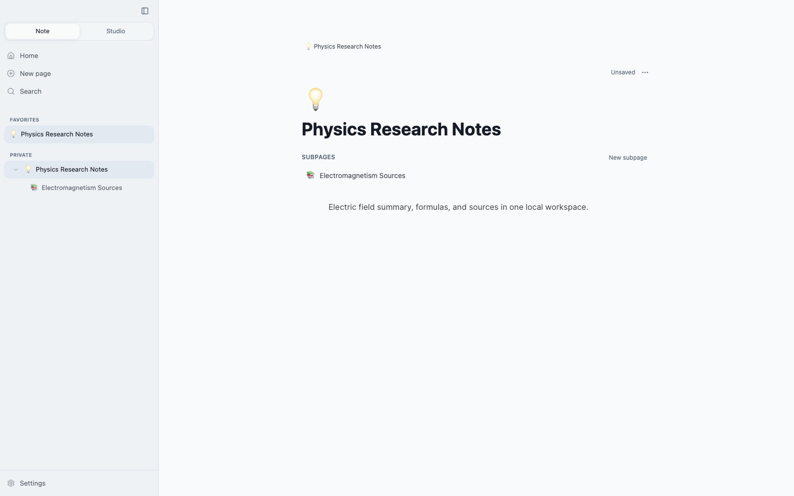
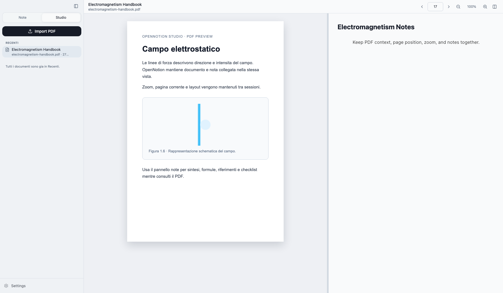

# OpenNotion

OpenNotion is a local-first workspace for notes, study, and research. It keeps your pages, documents, and working context on your Mac, with a Notion-inspired editor and a focused Study/Research flow for reading sources while writing notes.

The active macOS product is the native SwiftUI app. The Tauri/React app remains in the repository as a legacy implementation and parity reference while native features continue to catch up.



## Why OpenNotion

- Local-first by default: your workspace lives in app data, not a remote account.
- Notion-style writing: pages, subpages, icons, favorites, slash-style blocks, lists, checklist, code, divider, and drag/drop ordering.
- Study mode: import a PDF, keep the document on one side, and write the linked note on the other.
- Research workspace: native macOS browser workspace with linked notes, tags, checklist, citations, favorites, archive, and search.
- Safe native storage: the native app uses a separate bundle ID and database from the legacy Tauri app.
- Developer-friendly stack: SwiftUI + GRDB for native macOS, React/Tauri retained for comparison and migration work.

## Study Mode

Studio is built for students and researchers who need to read and write in the same place. Import a local PDF, keep the PDF and its note tied together, and return later with viewer state intact.



Current Studio capabilities in the Tauri reference app:

- PDF import through local file copy.
- One linked note per PDF.
- PDF left / note right by default, with layout switch support.
- Resizable split view.
- Zoom and current page controls.
- Recent documents and all documents in the Studio sidebar.
- Rename and delete document actions.
- Persisted viewer page, zoom, and panel layout.

Native parity work tracks this behavior in `docs/native-parity-roadmap.md`.

## Native Research Workspace

The native macOS app now includes a Research section designed around source-driven note taking:

- Workspace sidebar for research areas.
- Embedded browser view for websites, documentation, papers, and local PDFs.
- Linked note panel with tags, checklist, citations, and related notes.
- JSON-backed research repository for lightweight local persistence.
- Favorites, recents, archive, and search across titles, URLs, and note fields.

This is separate from the legacy Tauri Studio implementation and lives in the native SwiftPM package under `native-macos`.

## Core Notes Experience

OpenNotion supports the everyday workspace loop:

1. Create a page or subpage.
2. Add an icon, title, and structured blocks.
3. Move pages through the sidebar.
4. Favorite important pages.
5. Search by title and content.
6. Move pages to Trash, restore them, or permanently delete after confirmation.

The native editor stores BlockNote-compatible document content so the project can keep interoperability with the original Tauri editor while moving toward a fully native macOS experience.

## Architecture

### Native macOS

- UI: SwiftUI.
- Storage: SQLite through GRDB.
- Package: SwiftPM in `native-macos`.
- Data path: `~/Library/Application Support/org.opennotion.native/opennotion-native.db`.
- Release artifact: native `.app` and DMG from `scripts/package-native-macos.sh`.

### Legacy Tauri

- Frontend: React, TypeScript, Vite, Tailwind CSS, BlockNote.
- Desktop shell: Tauri 2.
- Storage: SQLite through Rust `sqlx`.
- Data path: `~/Library/Application Support/org.opennotion.desktop/opennotion.db`.

The native app and the legacy Tauri app intentionally use different bundle identifiers and different databases. Any migration or import between them must be an explicit user action.

## Development

Install dependencies:

```sh
npm install
```

Run native macOS checks:

```sh
npm run check:native
```

Build and launch the native macOS app:

```sh
script/build_and_run.sh --verify
```

Package native macOS release artifacts:

```sh
npm run release:package:macos
npm run release:verify:macos
```

Run legacy Tauri checks:

```sh
npm run check:tauri
```

Build the legacy Tauri app:

```sh
npm run tauri build
```

Run all checks:

```sh
npm run check
```

Production native signing and notarization use `.github/workflows/macos-release.yml`.

## Repository Hygiene

Generated artifacts are ignored:

- `node_modules`
- `dist`
- `src-tauri/target`
- local SQLite databases

Keep source, config, lockfiles, screenshots, docs, and tests under version control.
