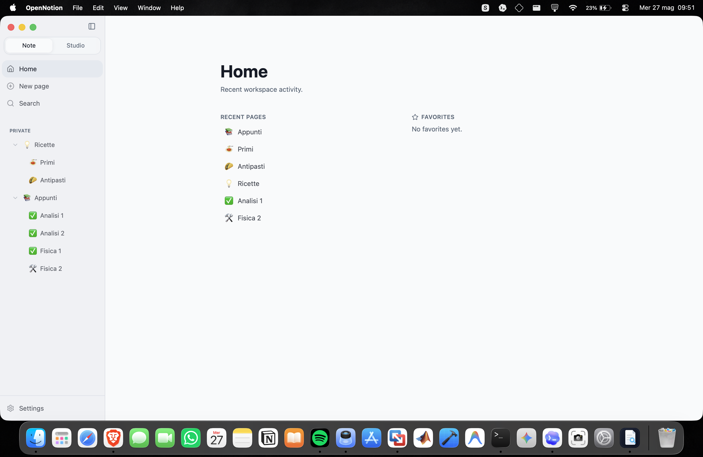
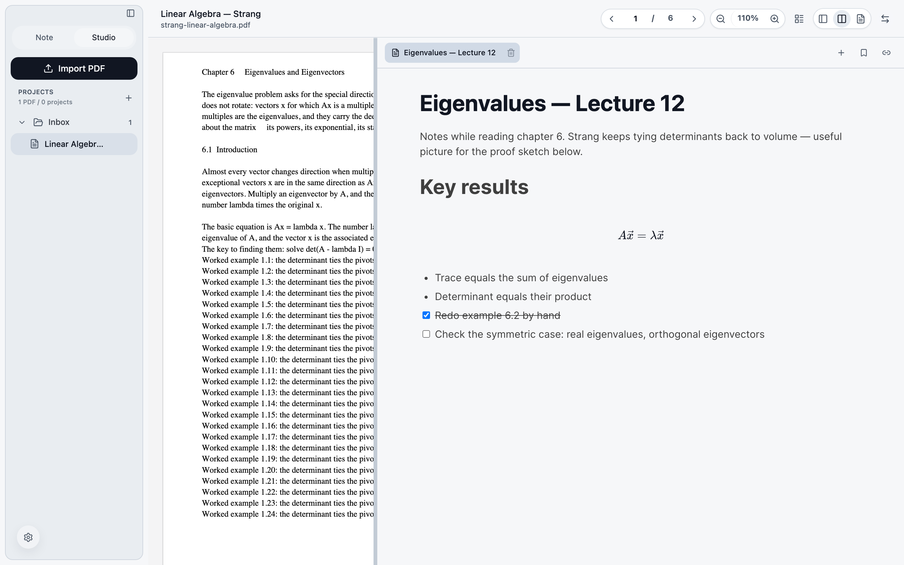
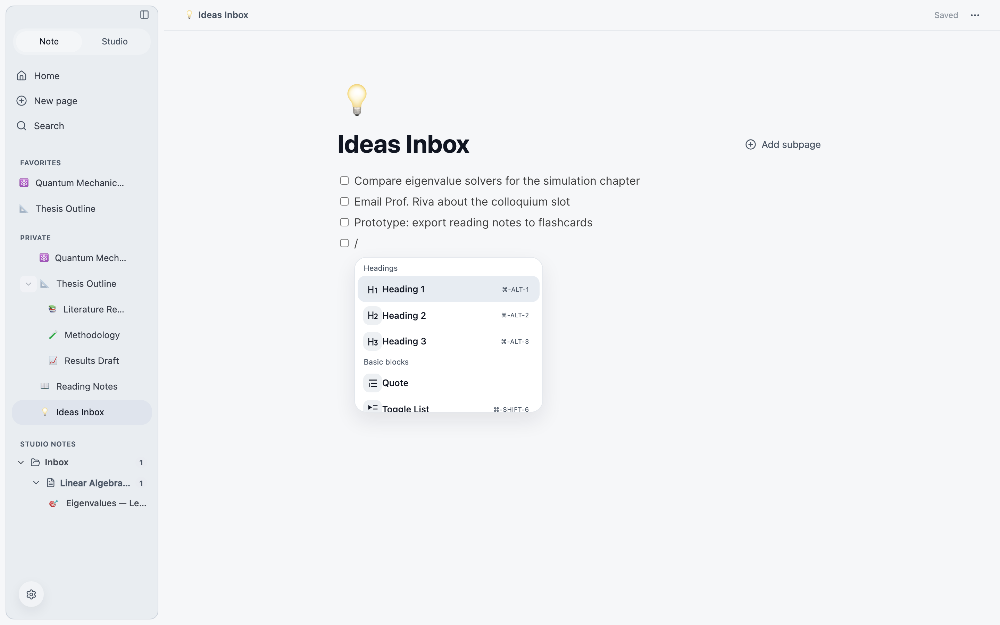
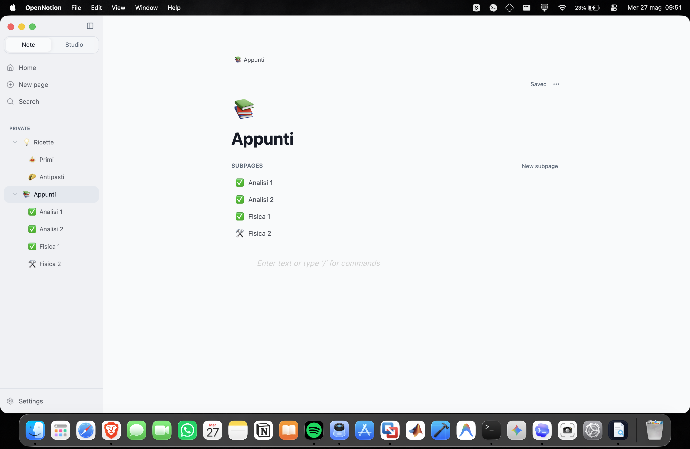
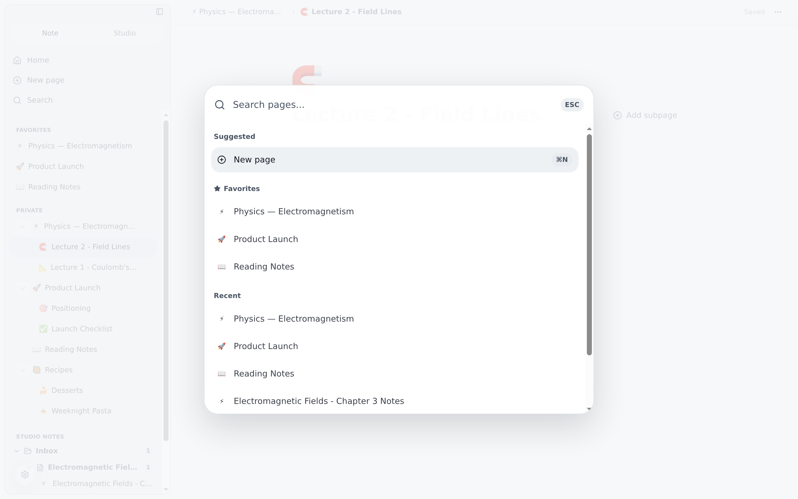

<div align="center">


# OpenNotion

**Your notes. Your PDFs. Your machine. Nothing else.**

A local-first desktop workspace that pairs a Notion-style editor with a
Studio mode for reading PDFs while writing linked notes — with every byte
stored on your own computer.

<br>

[](https://github.com/marcoodignoti/OpenNotion/releases/latest)
[](https://github.com/marcoodignoti/OpenNotion/releases)
[](https://github.com/marcoodignoti/OpenNotion/actions/workflows/ci.yml)
[](LICENSE)


<br>

[](https://github.com/marcoodignoti/OpenNotion/releases/download/v0.2.0/OpenNotion_0.2.0_arm64.dmg)
&nbsp;
[](https://github.com/marcoodignoti/OpenNotion/releases/download/v0.2.0/OpenNotion_0.2.0_setup_win-x64.exe)

<sub>or browse <a href="https://github.com/marcoodignoti/OpenNotion/releases/latest">all release downloads</a>, including a portable Windows zip</sub>

<br><br>



</div>

---

## Why OpenNotion?

Most note apps make you a tenant: your pages live in someone else's cloud,
behind someone else's account, on someone else's terms. OpenNotion flips
that.

- 🔒 **Local-first, by design** — everything lives in a SQLite database in
  your app data folder. No account. No sync server. No telemetry backend in
  this repository. Period.
- ✍️ **A real block editor** — pages, subpages, slash commands, checklists,
  toggles, code blocks, LaTeX formulas, drag-and-drop ordering. The writing
  experience you expect, offline.
- 📚 **Studio mode for deep work** — import a PDF and read it side-by-side
  with a linked note. Zoom, current page, and panel layout are remembered,
  so you resume exactly where you left off.
- ⚡ **Fast at any size** — opening a Studio document takes the same time at
  10 or 800 pages, with flat memory thanks to off-screen page bitmap
  release. Performance budgets are tracked in CI.
- 🛟 **Your data is treated like it matters** — automatic database backups
  before every schema migration, signed update manifests, SHA-256 verified
  artifacts.

## See It in Action

### 📖 Studio: read sources, write notes — one screen

Built for students, researchers, and anyone who thinks with a PDF open.
Split view, continuous / single / two-page reading modes, projects and
folders to keep sources organized.



### ✍️ Write at the speed of `/`

Type `/` and drop in headings, lists, checklists, quotes, dividers, code,
and formulas without touching the mouse. Pasted LaTeX is detected and
rendered automatically.



### 🗂️ Organize and find anything

Nested pages with icons, favorites, recents, trash with recovery — and a
keyboard-first command palette that searches your whole workspace.

| | |
| :---: | :---: |
|  |  |
| **Pages, subpages, favorites** | **Instant workspace search** |

## Privacy Model

There is no account system and no cloud backend in this repository. Your
workspace is a folder on your disk:

```text
~/Library/Application Support/org.opennotion.desktop/   # macOS
├── opennotion.db        # pages, metadata, search text
├── covers/              # page covers
├── editor-images/       # pasted/imported images
├── studio-documents/    # imported PDFs
└── backups/             # automatic pre-migration snapshots
```

Build artifacts never include your personal database. Want to know exactly
where everything lives? See [docs/release/data-location.md](docs/release/data-location.md).

## Install

**[⬇ Grab the latest release](https://github.com/marcoodignoti/OpenNotion/releases/latest)** — current version: **v0.2.0**

| Platform | Artifact | Notes |
| --- | --- | --- |
| macOS (Apple Silicon) | `OpenNotion_0.2.0_arm64.dmg` | Ad-hoc signed, not yet notarized — see below |
| Windows x64 (installer) | `OpenNotion_0.2.0_setup_win-x64.exe` | Auto-updates in background, installs on quit |
| Windows x64 (portable) | `OpenNotion_0.2.0_win-x64.zip` | Extract and run `OpenNotion.exe` |

> **Heads-up on OS warnings:** builds are not yet notarized (macOS) or
> Authenticode-signed (Windows), so Gatekeeper / SmartScreen will warn on
> first launch. On macOS, after copying the app to `/Applications`:
>
> ```sh
> xattr -dr com.apple.quarantine /Applications/OpenNotion.app
> ```
>
> Signed and notarized distribution is on the [roadmap](#roadmap).
> Every release ships SHA-256 digests so you can verify what you download.

Prefer building from source?

```sh
npm ci
npm run release:package:macos   # → dist-electron/OpenNotion_<version>_arm64.dmg
```

## Under the Hood

OpenNotion is a thin React UI over an Electron/SQLite backend — no hidden
services, no network layer for your data.

```text
React 19 + TypeScript + Vite + Tailwind 4 + BlockNote
                      │
            Electron preload bridge (typed IPC)
                      │
              Electron main process
                      │
          SQLite + local filesystem app data
```

| Area | Where |
| --- | --- |
| Workspace UI, editor, Studio, state | `src/` |
| Electron main/preload/backend + packaged-app smokes | `electron/` |
| Packaging & release verification | `scripts/`, `packaging/` |
| Browser e2e flows | `tests/e2e/` |
| Performance suite & baselines | `perf/`, `docs/perf/` |

Quality gates: unit tests (Vitest), Playwright e2e, visual/parity/stability
smokes against the packaged app, dependency audit, and tracked performance
budgets — all wired into `npm run check`.

## Development

```sh
npm ci                 # install dependencies (Node.js 22+)
npm run electron:dev   # full Electron app with hot-reloading renderer
npm test               # unit tests
npm run e2e            # browser e2e (run `npm run e2e:install` once first)
npm run check          # the full local gate
```

Contributions welcome — see [CONTRIBUTING.md](CONTRIBUTING.md) and
[SECURITY.md](SECURITY.md).

## Roadmap

- [x] Notion-style editor with slash commands, formulas, and drag/drop
- [x] Studio mode: PDF + linked note, viewer state persistence, projects
- [x] Page export/import with hardened, main-process-only file access
- [x] Automatic database backups before schema migrations
- [x] Signed beta update manifests (Ed25519) with SHA-256 verified artifacts
- [ ] Notarized macOS distribution
- [ ] Authenticode-signed Windows installer
- [ ] Richer Studio workflows for research projects
- [ ] Import/export and backup tooling improvements

## License

MIT — see [LICENSE](LICENSE). Third-party dependency notes live in
[THIRD_PARTY_NOTICES.md](THIRD_PARTY_NOTICES.md).

The OpenNotion name, app icon, screenshots, and repository assets are
included for use with this project. Do not use them to imply endorsement of
unrelated software.

---

<div align="center">

**If OpenNotion looks useful, [⭐ star the repo](https://github.com/marcoodignoti/OpenNotion) — it genuinely helps.**

Built by [Marco Dignoti](https://github.com/marcoodignoti)

</div>
