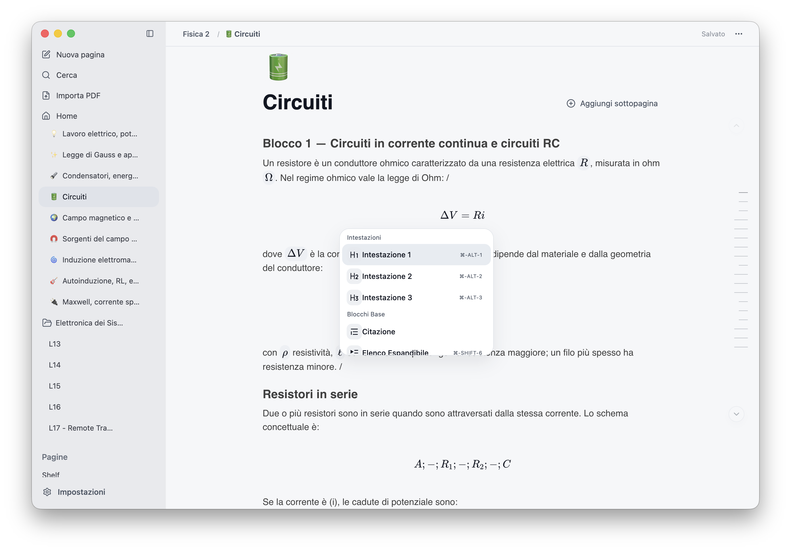
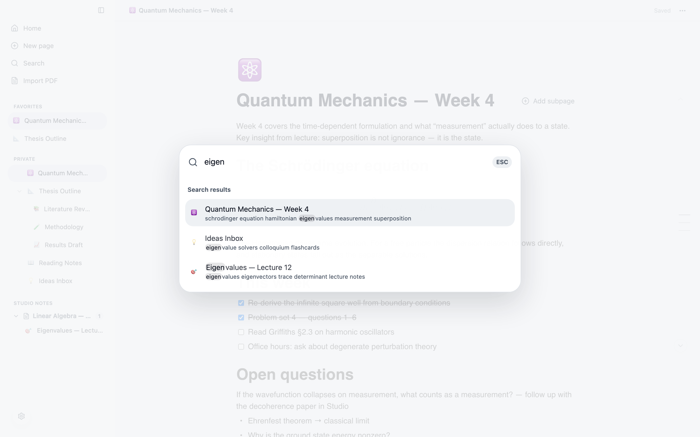
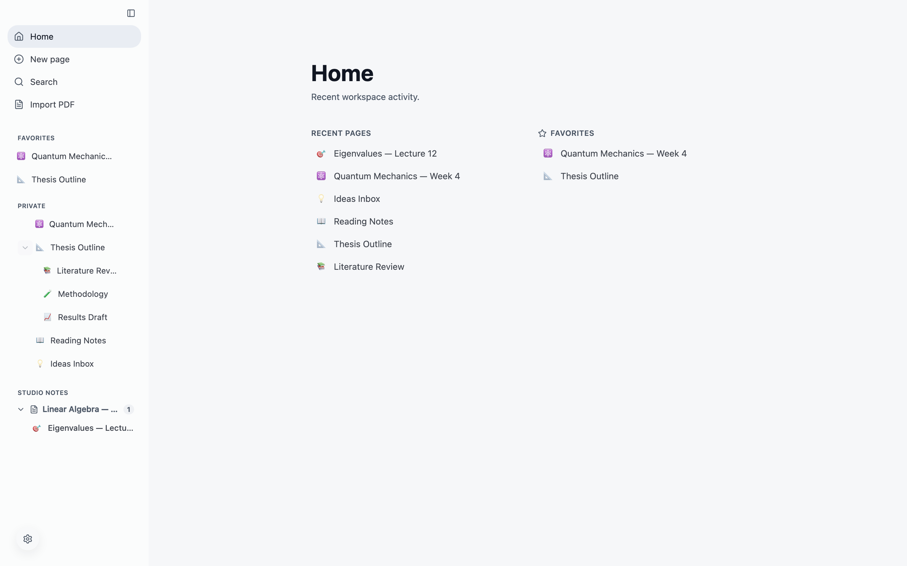

# Shelf

<p align="center">
  
</p>

<p align="center">
  <strong>A local-first desktop workspace for notes, PDFs, study, and research.</strong><br>
  Notion-style writing and a split-screen PDF Studio — everything stays on your machine.
</p>

<p align="center">
  <a href="https://github.com/marcoodignoti/Shelf/releases/latest"></a>
  <a href="https://github.com/marcoodignoti/Shelf/releases"></a>
  <a href="https://github.com/marcoodignoti/Shelf/actions/workflows/ci.yml"></a>
  
  
</p>

<p align="center">
  <a href="https://marcoodignoti.github.io/Shelf/"><b>Website</b></a> ·
  <a href="#installation"><b>Download</b></a> ·
  <a href="#why-shelf">Why</a> ·
  <a href="#product-tour">Tour</a> ·
  <a href="#privacy-model">Privacy</a> ·
  <a href="#development">Development</a>
</p>

<picture>
  <source media="(prefers-color-scheme: dark)" srcset="docs/assets/shelf-dark.png">
  
</picture>

> 🎬 **Demo coming soon.** A 10–15s GIF of the Studio workflow is in progress
> (see [`scripts/make-demo-gif.sh`](scripts/make-demo-gif.sh)). Until then, the
> screenshot above shows the editor; see
> [Studio: read and write in one place](#studio-read-and-write-in-one-place)
> for the PDF side.

## Who is this for?

Shelf is for:

- **students** managing lecture notes and PDFs;
- **researchers** reading papers and writing linked notes;
- **people who want a Notion-like writing experience** without cloud lock-in;
- **anyone who wants their notes, PDFs, and annotations stored locally** in an open,
  exportable format.

## Why Shelf

Your notes, your PDFs, your annotations — on your disk, in an open format you
can export at any time. Shelf is for people who want a polished document
workspace without sending their study and research context to a remote
account.

- **Local-first, no account**: everything lives in SQLite on your machine.
  There is no cloud backend, no telemetry, no sign-up.
- **A real editor**: slash commands, headings, checklists, code blocks,
  KaTeX formulas, quotes, tables, images, video, drag-and-drop blocks.
- **A real PDF workflow**: read a source and write the linked note side by
  side, with viewer position, zoom, and layout remembered per document.
- **Your data stays portable**: export any page or page tree as Markdown or
  JSON, and the database is backed up automatically before every app update.
- **Private beta updates**: signed manifests and SHA-256 checks keep assisted
  update downloads tied to official Shelf releases.

## Product Tour

### Write like you think

Type `/` for structured blocks. Paste LaTeX from anywhere — ChatGPT-style
`\[ ... \]` fences included — and it becomes a rendered formula block.



### Studio: read and write in one place

Import a PDF and Shelf pairs it with a linked note in a split workspace.
Page through with arrow keys or trackpad swipes, switch between continuous,
single, and two-page modes, and pick up exactly where you left off — even in
800-page documents, with flat memory use.


### Find anything fast

`⌘K` searches titles and full page content, and jumps straight to recent
pages.



### Home, favorites, and a tidy sidebar

Recents and favorites on the Home dashboard; pages, subpages, Studio projects
and folders in the sidebar, all reorderable by drag and drop.



### Dark mode included

The whole workspace — editor, Studio, search — follows your system theme or
your explicit choice.


## Installation

Grab the latest build from the **[releases page](https://github.com/marcoodignoti/Shelf/releases/latest)** — pick the file for your platform:

| Platform | File | Notes |
|---|---|---|
| macOS (Apple Silicon) | `Shelf_<version>_arm64.dmg` | First launch needs one extra step, see below |
| Windows 10/11 (x64) | `Shelf_<version>_setup_win-x64.exe` | Installer with signed in-app update notice |
| Windows portable | `Shelf_<version>_win-x64.zip` | Extract and run `Shelf.exe` |

### macOS (Apple Silicon)

Download the `.dmg`, or use Homebrew:

```sh
brew tap marcoodignoti/shelf
brew install --cask shelf-beta
```

The macOS build is ad-hoc signed (hardened runtime, not notarized), so
Gatekeeper warns about an unidentified developer on first launch. After
copying the app to `/Applications`, either:

- **Right-click the app → Open → Open** (only needed once), or
- clear the quarantine flag from a terminal:

  ```sh
  xattr -dr com.apple.quarantine /Applications/Shelf.app
  ```

The app checks for updates itself: signed manifest, SHA-256-verified
downloads.

### Windows

Download `Shelf_<version>_setup_win-x64.exe`. The installer updates
itself: new versions download in the background and a **Restart to update**
button applies them in place.

Prefer no installer? `Shelf_<version>_win-x64.zip` is a portable build —
extract and run `Shelf.exe`.

Windows builds are not yet Authenticode-signed, so SmartScreen may warn on
first run — choose **More info → Run anyway**.

## Privacy Model

Shelf has no account system and no cloud backend.

Default macOS data path:

```text
~/Library/Application Support/org.opennotion.desktop/
```

Shelf keeps this legacy beta folder intentionally so existing local workspaces
keep opening after the product rename.

Important local files:

```text
opennotion.db      # pages, Studio metadata
backups/           # automatic pre-update database snapshots (last 5)
covers/            # page cover images
editor-images/     # pasted/imported media
studio-documents/  # imported PDFs
```

Build artifacts never include your personal database; an installed build
starts from that computer's own empty workspace.

## Development

Built with Electron, React 19, TypeScript, BlockNote, and SQLite. Requires
Node.js 22+.

```sh
npm ci                 # install dependencies
npm run electron:dev   # run the desktop app against the Vite dev server
npm run check          # full gate: build, unit, e2e smoke, audit
npm run e2e            # browser end-to-end tests (Playwright)
npm run perf           # performance suite (see perf/README.md)
```

Release notes live in [`docs/release/notes`](docs/release/notes), performance
baselines in [`docs/perf`](docs/perf).

Regenerate README screenshots from a built preview:

```sh
npm run screenshots:readme
```

## License

[MIT](LICENSE)
