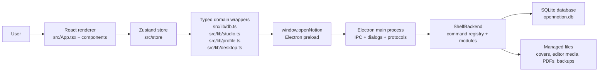
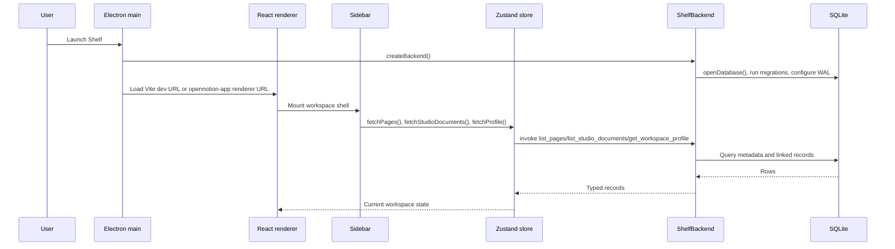
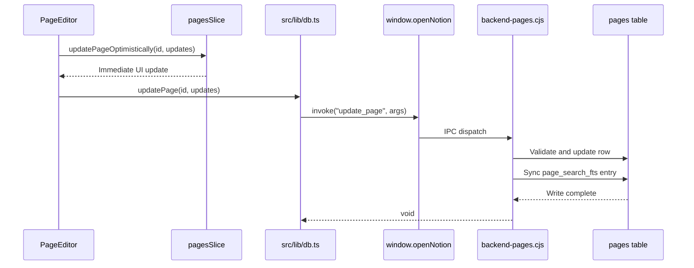
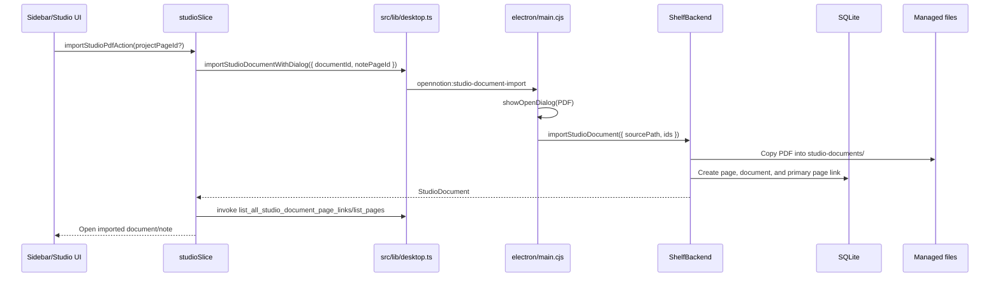
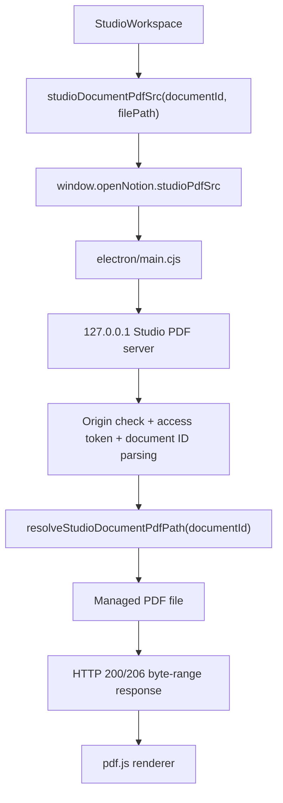
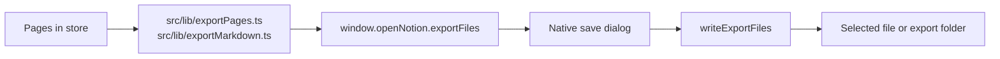
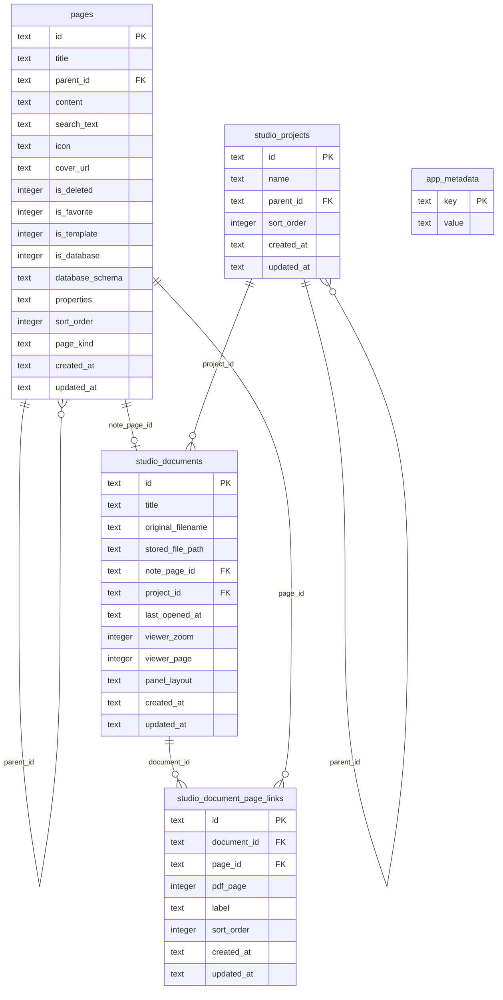

# Shelf System Architecture

Shelf is a local-first desktop workspace for notes, PDFs, study, and research. It combines a React renderer, an Electron shell, and a SQLite database accessed through a typed IPC boundary. The renderer never opens the database directly; every persistent operation goes through `window.openNotion` and the backend command registry.

## High-Level Overview

Shelf has four major runtime layers:

1. **Renderer UI**: React 19, TypeScript, Vite, Tailwind 4, BlockNote, pdf.js, and Zustand. The renderer owns interaction, editor state, view selection, optimistic UI updates, and PDF viewing.
2. **Preload bridge**: `electron/preload.cjs` exposes a narrow `window.openNotion` API with command invocation, file dialogs, asset URL helpers, Studio PDF URL helpers, and desktop update events.
3. **Electron main process**: `electron/main.cjs` creates the app window, registers the custom app protocol, handles native dialogs, starts the local Studio PDF server, enforces trusted renderer origins, and dispatches IPC calls.
4. **Backend and storage**: `electron/backend.cjs` composes backend command modules over a Node SQLite connection. It owns schema setup, migrations, file import/export, backups, managed asset paths, update downloads, and page/Studio persistence.



## Repository Sections

### Renderer Application

- `src/main.tsx` boots the React app.
- `src/App.tsx` performs state-driven routing. There is no URL router; the active view is derived from `currentPageId`, `currentStudioDocumentId`, and whether Studio pages are unified.
- `src/components/Layout.tsx` provides the shell and sidebar frame.
- `src/components/Sidebar.tsx` loads pages, Studio documents, and profile state and exposes workspace navigation.
- `src/components/HomeView.tsx`, `src/components/PageEditor.tsx`, and `src/components/StudioWorkspace.tsx` are the primary workspace surfaces.
- `src/components/settings/*` implements settings, data, updates, appearance, shortcuts, profile, and about panels.

### Pure Renderer Logic

Most non-trivial renderer logic lives under `src/lib/` with co-located tests:

- Page trees, ordering, navigation, breadcrumbs, search display, and export helpers.
- Editor math, media, links, slash menu, save state, drag behavior, title input, and table helpers.
- Studio PDF math, continuous page windows, page links, workspace preferences, and project/sidebar helpers.
- Desktop command typing and bridge wrappers.

### State Management

`src/store/useAppStore.ts` composes Zustand slices:

- `sharedSlice`: current page/document IDs, loading state, command palette state, notices, and errors.
- `pagesSlice`: note CRUD, page import/export, page movement, favorites/templates, project note export, and optimistic page updates.
- `studioSlice`: Studio document import, PDF replacement, viewer state persistence, Studio note recovery, document rename/delete, and Studio document link hydration.
- `profileSlice`: workspace profile loading, profile edits, and avatar import.

`src/store/useUIStore.ts` holds local UI preferences such as theme, locale, sidebar state, and sidebar width.

### Electron Boundary

- `electron/preload.cjs` exposes `window.openNotion` through `contextBridge`.
- `src/lib/desktop.ts` wraps the preload bridge for renderer code.
- `src/lib/desktopCommands.ts` defines the typed command map shared by renderer wrappers.
- `electron/main.cjs` owns IPC handlers, native dialogs, protocol registration, CSP, asset serving, Studio PDF streaming, menu setup, and update restart events.
- `electron/backend-command-registry.cjs` maps command names to backend methods.

### Backend Modules

`electron/backend.cjs` creates `ShelfBackend`, opens SQLite, composes feature modules, and exposes `invoke(command, args)`.

Backend modules are split by domain:

- `backend-pages.cjs`: pages, templates, projects, search, ordering, imports.
- `backend-studio-documents.cjs`: Studio PDF document lifecycle and viewer state.
- `backend-studio-projects.cjs`: Studio project folders and nesting.
- `backend-studio-links.cjs`: links between Studio documents and pages.
- `backend-studio-unification.cjs`: migration and preview logic for unified Studio pages.
- `backend-profile.cjs`: workspace profile metadata.
- `backend-assets.cjs`: cover images, editor media, profile avatars, managed asset paths.
- `backend-backup.cjs`: JSON backup import/export.
- `backend-updates.cjs`: signed update manifest and artifact handling.
- `backend-helpers.cjs`: schema, migrations, validations, path safety, update verification helpers, FTS indexing, and shared constants.

### Storage

The default data directory remains the legacy beta path:

```text
~/Library/Application Support/org.opennotion.desktop/
```

Important files and folders:

```text
opennotion.db      # SQLite database
backups/           # automatic pre-migration and pre-update database snapshots
covers/            # imported page cover images
editor-images/     # editor image assets
editor-videos/     # editor video assets
profile/           # profile avatar assets
studio-documents/  # copied-in PDF files
```

## Component Interactions

### Application Boot



### Page Editing

`PageEditor` receives the active `Page` from `App`. Edits update in-memory page state first and persist through the typed page wrapper. Backend writes also keep `search_text` and the FTS search index aligned.



### Studio PDF Import

PDF import uses native dialogs in the main process so the renderer does not directly supply arbitrary filesystem paths.



### Studio PDF Viewing

The PDF file is not loaded from an arbitrary `file://` URL. The main process starts a loopback-only HTTP server with a per-session token. pdf.js fetches byte ranges from that server.



### Backup and Export

There are two export paths:

- Workspace backup: JSON backup import/export is handled by backend backup commands and native dialogs.
- Page/tree export: renderer builds Markdown/JSON content, then main-process file helpers write selected files after a save dialog.



## Data Model

### Core Tables



### Universal Page Model

`pages` is the universal workspace entity. It stores ordinary notes, subpages, templates, database pages, project pages, and Studio note pages. These are distinguished by flags and `page_kind`:

- `note`: normal user note.
- `studio_note`: note paired with a Studio PDF document.
- `project`: page-tree representation for projects/folders.

Studio documents keep PDF metadata and viewer state in `studio_documents`, but their linked note content still lives in `pages`.

## Design Decisions and Rationale

### Local-First Desktop App

Shelf deliberately avoids a cloud backend, accounts, and telemetry. SQLite and managed local files make data private, inspectable, backupable, and portable. Electron provides the native shell, filesystem access, native dialogs, and packaging path while React keeps the UI iteration loop fast.

### IPC as the Persistence Boundary

All persistence goes through `window.openNotion`. This keeps database and filesystem authority in Electron's Node runtime, not the browser-like renderer. Renderer code normally uses `src/lib/db.ts`, `src/lib/studio.ts`, `src/lib/profile.ts`, `src/lib/backup.ts`, or `src/lib/desktop.ts` instead of inline `invoke` calls.

### Typed Command Contract

`src/lib/desktopCommands.ts` mirrors the backend command registry and gives renderer code typed request/response shapes. The backend still validates inputs at runtime because IPC is a trust boundary.

### Modular Backend Over One SQLite Connection

The backend is split into domain modules but composed into a single `ShelfBackend` instance. This keeps feature ownership readable while preserving shared transactions, helpers, path validation, and one SQLite connection.

### Idempotent Startup Migrations

There is no migration framework. `runMigrations` uses `CREATE TABLE IF NOT EXISTS`, best-effort `ALTER TABLE ADD COLUMN`, index creation, and metadata versions. Before a new app version mutates an existing database, Shelf attempts to snapshot the database into `backups/`.

### Optimistic UI Updates

The store updates local state before awaiting backend writes for common actions such as rename, reorder, favorite, and viewer-state changes. On error, actions restore prior state or refetch canonical data, then surface a notice.

### Page-Centric Studio Unification

Studio notes are pages. A Studio document links to a primary note page and may also link to additional pages through `studio_document_page_links`. This avoids a separate note model and lets Studio content participate in navigation, search, export, and page hierarchy logic.

### Main-Process Native Dialogs for Sensitive Paths

Commands that operate on source or destination filesystem paths are routed through main-process dialog handlers. The renderer chooses intent, while Electron main obtains the user-approved path and passes it to backend code.

### Managed Asset URLs

Imported media and covers are copied into app-owned folders. The renderer receives app asset URLs generated from validated managed paths. This avoids exposing arbitrary local files and centralizes path traversal checks.

### Loopback Studio PDF Server

pdf.js benefits from HTTP byte-range requests for large PDFs. Shelf serves imported PDFs from a loopback-only server with origin checks and a random token. This gives pdf.js streaming behavior without making arbitrary local files reachable.

### Search Index Fallback

Shelf uses SQLite FTS5 when available and falls back to `LIKE` search if the FTS table cannot be created. This preserves basic search functionality across environments.

### Test Pyramid

The codebase favors focused unit tests for pure `src/lib` logic and backend modules, plus Playwright e2e tests for renderer workflows and Electron smoke/parity/visual/stability checks for packaged behavior.

## System Constraints and Limitations

### Platform and Runtime

- The app targets desktop Electron builds, currently macOS and Windows.
- Development expects Node.js 22+.
- The backend uses Electron/Node SQLite APIs and is not designed as a browser-only app.
- The renderer assumes the Electron preload bridge is available for real persistence. Browser e2e tests use a mocked bridge.

### Storage and Sync

- Data is local to one machine; there is no built-in cloud sync or multi-user collaboration.
- Concurrent app instances share one SQLite file and rely on SQLite locking plus a busy timeout. Simultaneous long-running writes are not a product goal.
- Schema migration is startup-based and idempotent, not a versioned migration framework.
- Automatic database backups retain only the configured recent snapshots.

### Renderer and IPC

- Renderer code should not import Node database or filesystem APIs.
- Command names must be registered in both the backend registry and the typed renderer command map.
- Runtime validation is still required in backend code; TypeScript types do not protect IPC callers at runtime.
- Native file paths should be collected by main-process dialogs or validated as managed asset paths.

### PDF and Media

- Studio PDFs are copied into app storage and have a maximum accepted file size.
- Studio PDF viewing caps page count and canvas dimensions to keep memory use bounded.
- Editor images and videos have size limits.
- The PDF server is process-local and only intended for the current renderer session.

### Search and Content Loading

- `list_pages` returns metadata-oriented rows and may omit full content.
- Search is bounded and prioritizes local responsiveness over exhaustive ranking.
- FTS availability depends on the SQLite build; fallback search is less capable.

### Updates and Releases

- Update manifests and artifacts are constrained to expected GitHub release URLs.
- Artifacts are size-limited, SHA-256 checked, and signature-verified where applicable.
- macOS builds may be ad-hoc signed rather than notarized depending on release process.
- Windows builds may trigger SmartScreen until Authenticode signing is configured.

### Testing

- Full e2e runs can be flaky under heavy load because specs share a Vite server.
- A failing Playwright spec should be rerun in isolation before treating it as a regression.
- Visual snapshots are platform-sensitive.

## System Role Prompts

Shelf itself does not include AI chat flows, LLM system prompts, or application runtime prompt templates. The only agent-facing role guidance in the repository is documentation for coding assistants and maintainers.

### Repository Coding-Agent Role

Use this role prompt when asking an AI coding assistant to work on Shelf:

```text
You are a senior engineer working in the Shelf repository, a local-first Electron desktop workspace for notes and PDFs. Read the existing code before making changes. Preserve the architecture: renderer persistence must go through window.openNotion IPC, typed wrappers belong in src/lib, backend commands belong in electron/backend-*.cjs and the command registry, and non-trivial pure logic belongs in src/lib with tests. Keep edits scoped, respect optimistic-update store patterns, and do not bypass Electron path validation or managed asset boundaries.
```

### Architecture Documentation Role

Use this role prompt when updating this document:

```text
You are a senior technical writer documenting Shelf's actual system architecture. Document only behavior present in the repository. Treat Electron IPC commands as the local application API. Include high-level structure, component interactions, data flow diagrams, design rationale, constraints, and security boundaries. Do not invent HTTP APIs, cloud services, or AI runtime prompts.
```

### API Documentation Role

Use this role prompt when updating `docs/api.md`:

```text
You are a senior technical writer documenting a local-first Electron application. Document only APIs that are present in the repository. Treat Electron IPC commands as local endpoints. Include request and response shapes, usage examples, constraints, and security boundaries. Do not invent HTTP routes or AI chat prompts.
```

## Maintenance Checklist

When changing architecture, update this document if any of these change:

- A new persistence path bypasses or extends `window.openNotion`.
- A backend command is added, renamed, removed, or moved to a new module.
- The SQLite schema, data directory, or managed asset folders change.
- Studio document/page linking semantics change.
- Startup migrations, backups, update verification, or PDF serving constraints change.
- The top-level renderer routing model changes.
